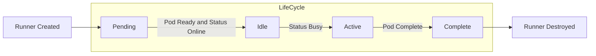
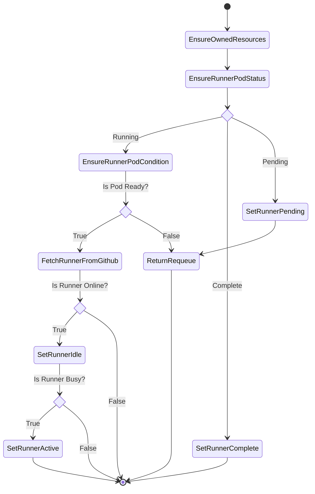

## Overview

Runner is a namespaced resource in octorun that represents a single Github self-hosted runner. It is designed to be ephemeral just like a Kubernetes Jobs. Once the owned Pod is complete e.g. has finished executing Github Workflow Job, the Runner will also mark it as complete. That is to ensure each Github Workflow Job is always run in a clean environment.

Runner's lifecycle itself relies on Owned Kubernetes Pod and Status from Github.



## Controller

The Runner controller has main responsibilities to:

- Ensuring runner registration token:
  - Creating runner registration token through Github API and stored as Kubernetes Secret.
  - Updating runner registration token when it has expires.
- Creating runner pod and setting OwnerReference on it.
- Keeping Runner's Status object up to date, by:
  - Watching runner pod status and condition.
  - Fetch runner information from Github.
- Finding Runner's ID by execing to the runner pod.
- Cleanup owned resources.

### Reconciliation Flow



## Example Runner

```yaml
apiVersion: octorun.github.io/v1alpha1
kind: Runner
metadata:
  name: octocat-runner
  labels:
    octorun.github.io/runner: octocat-runner
spec:
  url: https://github.com/octocat
  image:
    name: ghcr.io/octorun/runner:v2.288.1
```

## Runner Spec

As with all other Kubernetes config, a Job needs apiVersion, kind, and metadata fields. Its name must be a valid [DNS subdomain name][dns-subdomain-name].

The `.spec.url` and `.spec.image.name` are the only required field ot the Runner `.spec`. In the example above the Github self-hosted runner will created for `octocat` organization. The `spec.url` can be either Github organization URL or Github repository URL. The `.spec.image.name` is container image contains [runner][runner-binary] binary that will used for created Pod.

## Annotations & Labels

Runner controller respect known annotations & labels.

### Known Annotations

| Annotations                                   | Value             | Description       |
| :---                                          |    :----:         | :---              |
| `runner.octorun.github.io/assigned-job-at`    | `<timestamp>`     | Denote the Runner already assigned workflow job.   |

### Known Labels

Runner controller will pass each Kubernetes label with prefix `octorun.github.io/` to Github self-hosted runner labels.

| Labels                            | Value             | Description       |
| :---                              |    :----:         | :---          |
| `octorun.github.io/runner`        | `<string>`   | Labels Github self-hosted runner  with `runner=<string>`. If ommited default is Runner name |


<!-- Links -->
[dns-subdomain-name]: https://kubernetes.io/docs/concepts/overview/working-with-objects/names/#dns-subdomain-names
[runner-binary]: https://github.com/actions/runner
