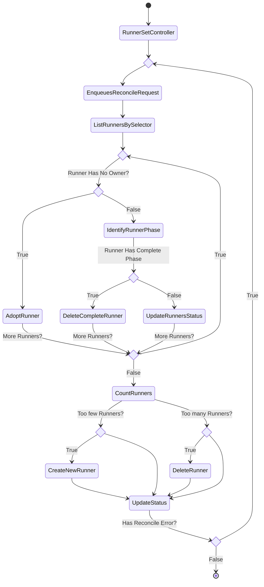

## Overview

A RunnerSet purpose is to maintain a set of Runners running at any given time. It is used to guarantee the availability of a specified number of identical Runners.

## Controller

The RunnerSet controller has main responsibilities to:

- Creating a Runner when actual owned runners is less than desired runners.
- Deleting a Runner when actual owned runners is more than desired runners.
- Deleting a Runner when its status phase is `Complete`
- Adopting unowned Runners that aren’t assigned to a RunnerSet

### Reconciliation Flow



## Example RunnerSet

```yaml
apiVersion: octorun.github.io/v1alpha1
kind: RunnerSet
metadata:
  name: octocat-runnerset
spec:
  runners: 3
  selector:
    matchLabels:
      octorun.github.io/runnerset: octocat-runnerset
  template:
    metadata:
      labels:
        octorun.github.io/runnerset: octocat-runnerset
    spec:
      url: https://github.com/octocat
      image:
        name: ghcr.io/octorun/runner:v2.288.1
```

In the example above, RunnerSet controller will create 3 Runners with same spec. Once one or more owned Runners has complete phase, The RunnerSet controller will delete them and create new Runners.
